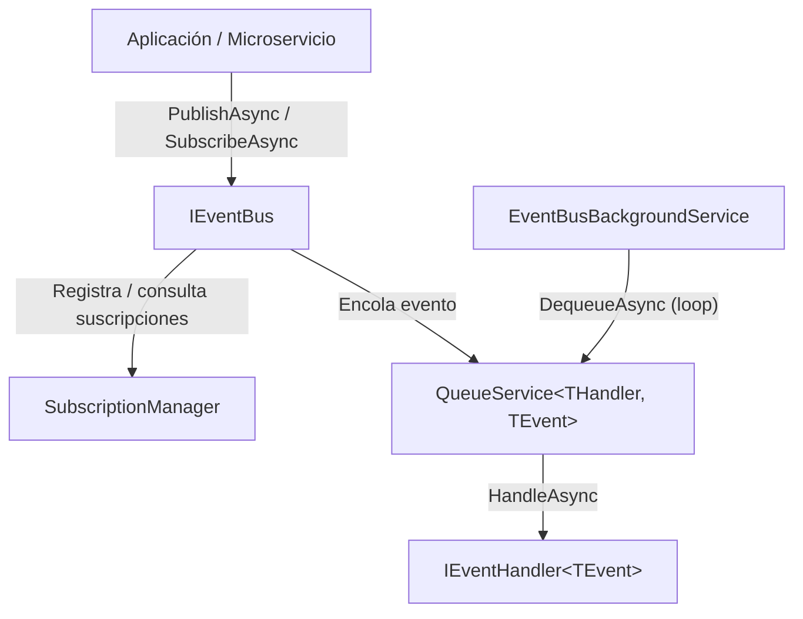
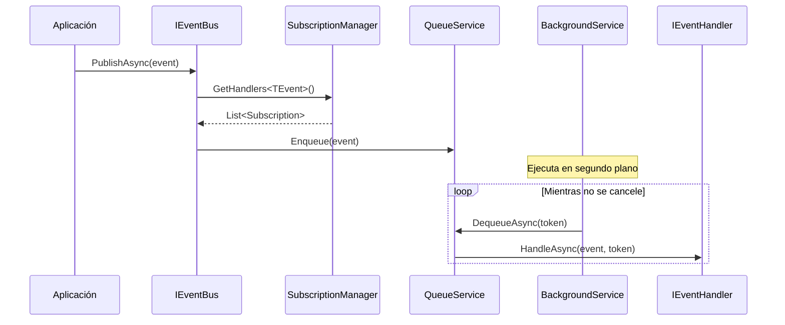
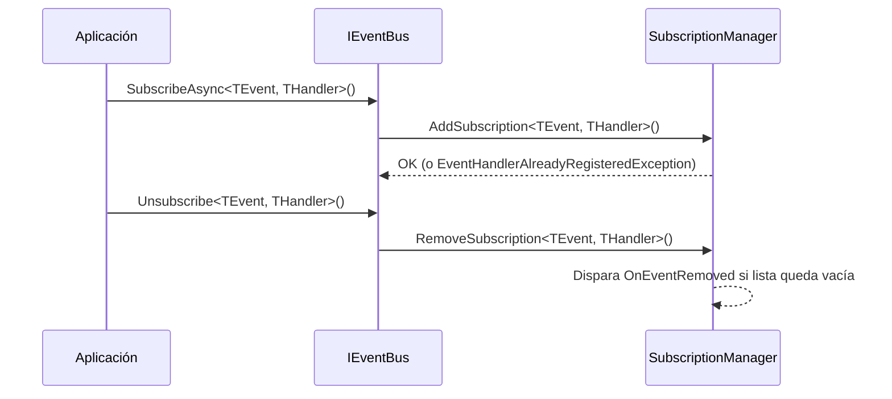
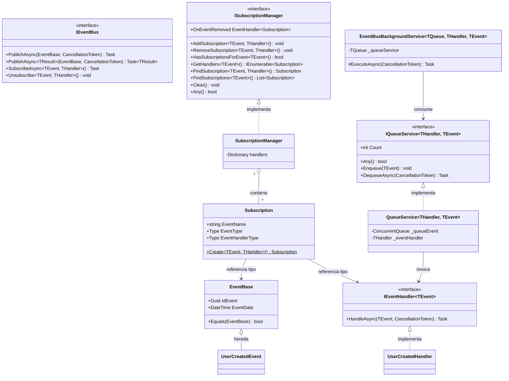
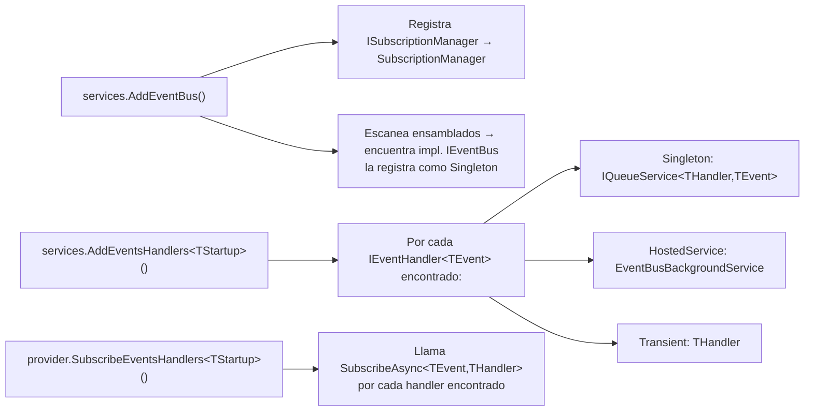

# Microservice.Event.Bus

Biblioteca de bus de eventos para microservicios en .NET 8 (C#). Proporciona un sistema ligero para publicar eventos y enrutar esos eventos a handlers suscritos, soportando entrega síncrona y asíncrona mediante un servicio background y una cola en memoria.

---

## Arquitectura general



---

## Flujo de publicación de un evento



---

## Flujo de suscripción y cancelación



---

## Modelo de clases



---

## Estructura del proyecto

```
Microservice.Event.Bus/
├── src/
│   └── Microservice.Event.Bus/
│       ├── Abstractions/
│       │   ├── EventBase.cs            # Clase base para todos los eventos
│       │   ├── IEventBus.cs            # Interfaz principal del bus
│       │   └── IEventHandler.cs        # Interfaz de los handlers
│       ├── Exceptions/
│       │   ├── EventBusException.cs
│       │   ├── EventHandlerAlreadyRegisteredException.cs
│       │   ├── EventIsNotRegisteredException.cs
│       │   ├── EventNotExistException.cs
│       │   └── EventNotImplementedException.cs
│       ├── Internal/
│       │   ├── Queue/
│       │   │   ├── IQueueService.cs
│       │   │   └── QueueService.cs     # Cola en memoria thread-safe
│       │   └── EventBusGackgroundService/
│       │       ├── IEventBusBackgroundService.cs
│       │       └── EventBusBackgroundService.cs  # BackgroundService de .NET
│       ├── Extension/
│       │   └── EventBusExtensions.cs   # Métodos de extensión para DI
│       ├── ISubscriptionManager.cs
│       ├── SubscriptionManager.cs      # Registro en memoria de suscripciones
│       └── Subscription.cs             # Metadatos de una suscripción
└── tests/
    └── Microservice.Event.Bus.Test/
```

---

## Registro en el contenedor DI

El método de extensión `AddEventBus` escanea los ensamblados cargados buscando la implementación concreta de `IEventBus` y la registra automáticamente. `AddEventsHandlers<TStartup>` descubre todos los `IEventHandler<TEvent>` del ensamblado de inicio y registra por cada uno:

- Un `QueueService<THandler, TEvent>` (Singleton)
- Un `EventBusBackgroundService` (Hosted Service)
- El propio handler (Transient)



### Ejemplo de uso en `Program.cs` / `Startup.cs`

```csharp
// Registro
builder.Services
    .AddEventBus()
    .AddEventsHandlers<MyStartup>();

// Suscripción (después de construir el host)
app.Services.SubscribeEventsHandlers<MyStartup>();
```

---

## Definir un evento y un handler

```csharp
// Evento: hereda de EventBase
public class UserCreatedEvent : EventBase
{
    public string UserId { get; set; }
    public string Email { get; set; }
}

// Handler: implementa IEventHandler<TEvent>
public class UserCreatedHandler : IEventHandler<UserCreatedEvent>
{
    public Task HandleAsync(UserCreatedEvent @event, CancellationToken token)
    {
        Console.WriteLine($"Usuario creado: {@event.UserId}");
        return Task.CompletedTask;
    }
}
```

---

## Publicar un evento manualmente

```csharp
// Inyectar IEventBus
public class UserService
{
    private readonly IEventBus _eventBus;

    public UserService(IEventBus eventBus) => _eventBus = eventBus;

    public async Task CreateUserAsync(string email, CancellationToken token)
    {
        // lógica de negocio...
        await _eventBus.PublichAsync(new UserCreatedEvent { UserId = "123", Email = email }, token);
    }
}
```

---

## Excepciones del dominio

| Excepción | Cuándo se lanza |
|---|---|
| `EventNotImplementedException` | No existe ninguna clase que implemente `IEventBus` en los ensamblados cargados |
| `EventIsNotRegisteredException` | Se consultan handlers de un evento que no está suscrito |
| `EventHandlerAlreadyRegisteredException` | Se intenta registrar el mismo handler dos veces para el mismo evento |
| `EventNotExistException` | El evento consultado no existe en el manager |
| `EventBusException` | Excepción base del dominio; las anteriores la heredan |

---

## Ejecutar pruebas

```bash
dotnet test
```

Los tests de integración y unitarios se encuentran en [tests/Microservice.Event.Bus.Test/](tests/Microservice.Event.Bus.Test/).

---

## Archivos clave

| Archivo | Descripción |
|---|---|
| [src/Microservice.Event.Bus/Abstractions/IEventBus.cs](src/Microservice.Event.Bus/Abstractions/IEventBus.cs) | Contrato principal del bus |
| [src/Microservice.Event.Bus/SubscriptionManager.cs](src/Microservice.Event.Bus/SubscriptionManager.cs) | Registro en memoria de suscripciones |
| [src/Microservice.Event.Bus/Internal/Queue/QueueService.cs](src/Microservice.Event.Bus/Internal/Queue/QueueService.cs) | Cola `ConcurrentQueue` thread-safe |
| [src/Microservice.Event.Bus/Internal/EventBusGackgroundService/EventBusBackgroundService.cs](src/Microservice.Event.Bus/Internal/EventBusGackgroundService/EventBusBackgroundService.cs) | Procesamiento asíncrono en segundo plano |
| [src/Microservice.Event.Bus/Extension/EventBusExtensions.cs](src/Microservice.Event.Bus/Extension/EventBusExtensions.cs) | Métodos de extensión para DI y auto-descubrimiento |
